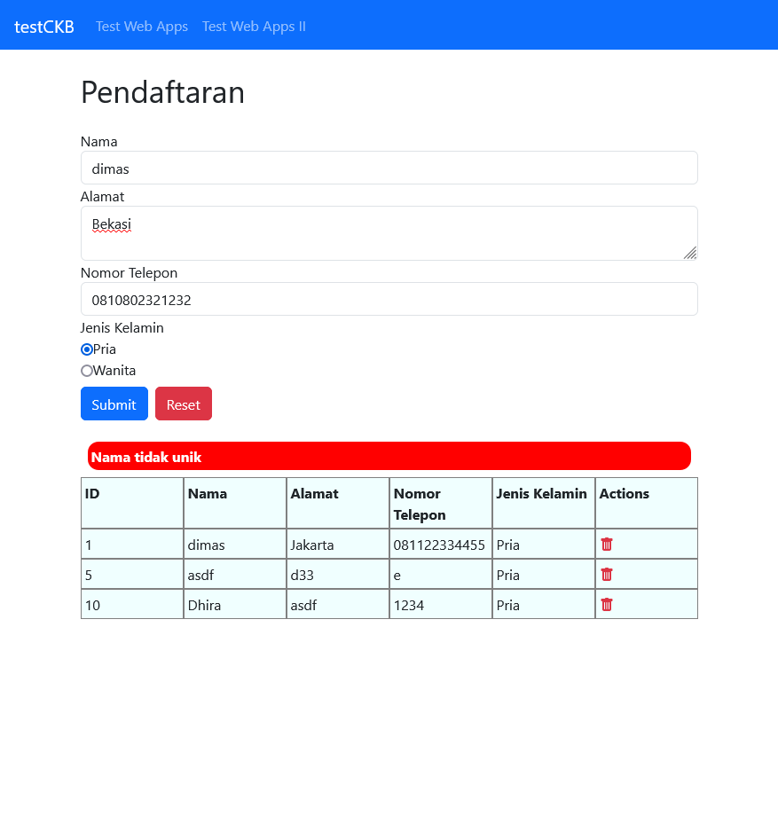
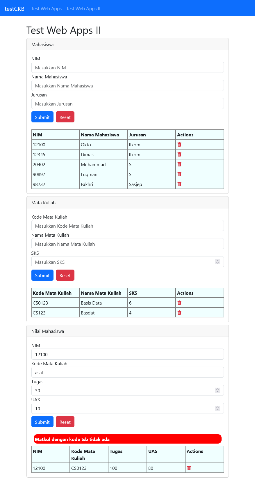

## Page 1

## Page 2

## Notes

Backend waktu itu tidak berfungsi karena urutan `use body-parser` dan
`defining routes` yang salah:

https://github.com/lepiku/test-ckb/blob/master/test-web-api/server.js#L16
